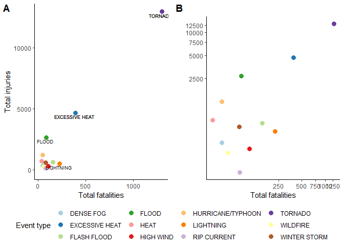
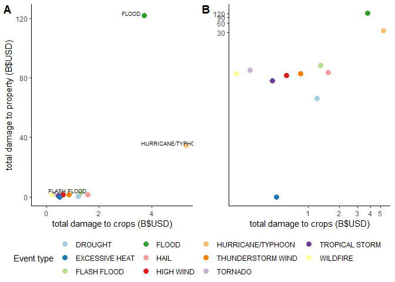

## An exploratory analysis of the impact of severe weather events on economy and population health across the United States. 

## Synopsis
Severe weather events may be responsible for damage to property, commerce, health and life.
The degree of this impact is likely to vary by the type of weather event.  
The U.S. National Oceanic and Atmospheric Administration's (NOAA) storm database includes data on severe weather events across the USA, categorised by approximately 50 weather event types, observed between the year 1950 and November 2011. 

This analysis addresses the following questions based on data within these dates: 

1. Across the United States, which types of events are most harmful with respect to population health?
Outcome data for population health are injury and fatality counts.

2. Across the United States, which types of events have the greatest economic consequences?
Outcome data for economic consequences are property damage and crop damage totals in USD.

## Data Processing


```r
knitr::opts_chunk$set(echo = TRUE)
```


### Data import

The following loads the required libraries and directory, downloads the dataset, reads it into RStudio, and provides the dataframe's size.


```r
library(dplyr)
```

```
## 
## Attaching package: 'dplyr'
```

```
## The following objects are masked from 'package:stats':
## 
##     filter, lag
```

```
## The following objects are masked from 'package:base':
## 
##     intersect, setdiff, setequal, union
```

```r
library(ggplot2)
library(ggpubr)
```

```
## Loading required package: magrittr
```

```r
library(lubridate)
```

```
## 
## Attaching package: 'lubridate'
```

```
## The following object is masked from 'package:base':
## 
##     date
```

```r
library(tidyverse)
```

```
## -- Attaching packages ------------------------------------------- tidyverse 1.2.1 --
```

```
## v tibble  2.1.3     v purrr   0.3.3
## v tidyr   1.0.0     v stringr 1.4.0
## v readr   1.3.1     v forcats 0.4.0
```

```
## -- Conflicts ---------------------------------------------- tidyverse_conflicts() --
## x lubridate::as.difftime() masks base::as.difftime()
## x lubridate::date()        masks base::date()
## x tidyr::extract()         masks magrittr::extract()
## x dplyr::filter()          masks stats::filter()
## x lubridate::intersect()   masks base::intersect()
## x dplyr::lag()             masks stats::lag()
## x purrr::set_names()       masks magrittr::set_names()
## x lubridate::setdiff()     masks base::setdiff()
## x lubridate::union()       masks base::union()
```


```r
setwd("C:/Users/Richard")

if (!file.exists("./RepData_PeerAssessment2")){
        dir.create("./RepData_PeerAssessment2")
}

fileUrl <- "https://d396qusza40orc.cloudfront.net/repdata%2Fdata%2FStormData.csv.bz2"

download.file(fileUrl, destfile="./RepData_PeerAssessment2/stormdata.csv.bz2")
```

The file is read and cached:

```r
setwd("C:/Users/Richard")
start_Time <- Sys.time()
stormdata <- read.csv("./RepData_PeerAssessment2/stormdata.csv.bz2")
end_Time <- Sys.time()
round(end_Time - start_Time,2)
```

```
## Time difference of 2.14 mins
```

```r
dim(stormdata)
```

```
## [1] 902297     37
```

```r
format(object.size(stormdata), units="auto")
```

```
## [1] "414.1 Mb"
```

### Data selection

There are 985 levels of the EVTYPE variable. 
The EVTYPE variable should contain the 48 levels specified in the data documentation. types stores the required levels and also includes the "LANDSLIDE", since no observations correspond to "DEBRIS FLOW" (see documentation). 


```r
stormdata <- stormdata %>% select(BGN_DATE,END_DATE,STATE,EVTYPE,FATALITIES, INJURIES, PROPDMG, PROPDMGEXP, CROPDMG, CROPDMGEXP,REMARKS)

types <- c("ASTRONOMICAL LOW TIDE", "AVALANCHE", "BLIZZARD", "COASTAL FLOOD",
           "COLD / WIND CHILL", "DEBRIS FLOW", "DENSE FOG", "DENSE SMOKE", "DROUGHT","DUST DEVIL","DUST STORM","EXCESSIVE HEAT","EXTREME COLD/WIND CHILL","FLASH FLOOD","FLOOD","FREEZING FOG","FROST/FREEZE","FUNNEL CLOUD","HAIL","HEAT","HEAVY RAIN","HEAVY SNOW","HIGH SURF","HIGH WIND","HURRICANE/TYPHOON","ICE STORM","LAKESHORE FLOOD","LAKE-EFFECT SNOW","LIGHTNING","MARINE HAIL","MARINE HIGH WIND","MARINE STRONG WIND","MARINE THUNDERSTORM WIND","RIP CURRENT","SEICHE", "SLEET","STORM SURGE/TIDE","STRONG WIND", "THUNDERSTORM WIND","TORNADO","TROPICAL DEPRESSION","TROPICAL STORM","TSUNAMI","VOLCANIC ASH","WATERSPOUT","WILDFIRE","WINTER STORM","WINTER WEATHER","LANDSLIDE")
```

### Health outcomes: Step 1 - Data selection

Interest is limited to events where more than 1 injury or fatality occurred. 880,368 entries are removed when including only data for which a single fatality or injury occurred. 

```r
healthdata <- stormdata[stormdata$INJURIES>0 & stormdata$FATALITIES>0,]

dim(healthdata)
```

```
## [1] 2649   11
```

```r
length(unique(healthdata$EVTYPE))
```

```
## [1] 86
```

```r
categories <- as.character(unique(healthdata$EVTYPE))

matched <-  categories[(categories %in% types)]
```

There are 86 unique categories in the EVTYPE variable in the preliminary injury and fatality data. 

### Health outcomes: Step 2 - Subsetting by date

How should the dates data be used?

```r
# Exploring/Formating dates

sum(healthdata$END_DATE=="")
```

```
## [1] 1209
```

```r
sum(healthdata$BGN_DATE=="")
```

```
## [1] 0
```

```r
any(is.na(healthdata$BGN_DATE))
```

```
## [1] FALSE
```

```r
# reformat BGN_DATE variable to date format
healthdata$BGN_DATE <- mdy_hms(healthdata$BGN_DATE) 
```
While the end date may be preferred as a measure of the timing of the event (for the purpose of assessing the outcome of the event), 45% (n=1,209) of the observations for this variable in the health outcome data is missing.
No observations are missing data for the beginning dates. 
Taken together, it is preferable to use only BGN_DATE as the indicator of the timing of the event. 

END_DATE is removed.  

```r
healthdata$END_DATE=NULL
```

### Health outcomes: Step 3 - Processing event type data

Can analysis be limited to the matched types?

```r
# i.e, can the observations corresponding to mismatched EVTYPES be removed?

#A new binary variable indicating whether or not the event types match the documentation is created:
healthdata$typematch <- healthdata$EVTYPE %in% matched

# Data split into matched and mismatched. 
# Match set is given by:
match <- healthdata[healthdata$typematch==TRUE,]

# Mis-matched set is given by:
mismatch <- healthdata[healthdata$typematch==FALSE,]

# Totals of fatality data per recorded event type for the matched/mismatched variables:
mismatchsumF <- mismatch %>% 
                group_by(EVTYPE) %>% 
                summarise(sum=sum(FATALITIES)) %>% 
                arrange(desc(sum))

matchsumF <- match %>% 
             group_by(EVTYPE) %>% 
             summarise(sum=sum(FATALITIES)) %>% 
             arrange(desc(sum))

#Totals of the injury data per recorded event type for the matched/mismatched variables:
mismatchsumI <- mismatch %>% 
                group_by(EVTYPE) %>% 
                summarise(sum=sum(INJURIES)) %>% 
                arrange(desc(sum))

matchsumI <- match %>% 
             group_by(EVTYPE) %>% 
             summarise(sum=sum(INJURIES)) %>% 
             arrange(desc(sum))
```

Although limiting analysis to the matched types will not likely affect the highest few weather types, the relative frequencies of matched and mismatched data indicate that removing observations with mismatched EVTYPE data may influence the ranking of the top 10 weather events by injuries and fatalities. Mismatched observations should be matched where possible. 

### Health outcomes: Step 4 - Further date subsetting 

Which date range is relevant to future allocation of resources to prevent fatalies and injuries arising from weather events?


```r
#Data are filtered according to date. Matched/mismatched data are viewed separately:

sumMatch <- match %>% 
        group_by(EVTYPE) %>% 
        summarize(COUNT=n(),
                  YEARS=n_distinct(year(BGN_DATE)),
                  FAT = sum(FATALITIES),
                  INJ = sum(INJURIES))

sumMismatch <- mismatch %>% 
        group_by(EVTYPE) %>% 
        summarize(COUNT=n(),
                  YEARS=n_distinct(year(BGN_DATE)),
                  FAT = sum(FATALITIES),
                  INJ = sum(INJURIES))

sumMatch_1996 <- match %>% 
        group_by(EVTYPE) %>% 
        filter(year(BGN_DATE)>="1996") %>%
        summarize(COUNT=n(),
                  YEARS=n_distinct(year(BGN_DATE)),
                  FAT = sum(FATALITIES),
                  INJ = sum(INJURIES))

sumMismatch_1996 <- mismatch %>% 
        group_by(EVTYPE) %>% 
        filter(year(BGN_DATE)>="1996") %>%
        summarize(COUNT=n(),
                  YEARS=n_distinct(year(BGN_DATE)),
                  FAT = sum(FATALITIES),
                  INJ = sum(INJURIES))
```

A comparison of the mismatched events including periods before 1996 with those after 1996 shows little is lost that could change the relative rankings of the events' impact, as judged by total injury and fatality counts. Therefore it seems reasonable to subset to observations from the beginning of 1996. The exact cut-off is somewhat arbitrary.

### Health outcomes: Step 5 - Integrating mismatched event type data to create final health dataset


Data will be subset by years since the beginning of 1996, giving recent context, and by threshold of total injuries > 25 and fatalities > 3 over the sixteen year period. Thresholds were decided based on the summary datasets: sumMatched_1996 and sumMismatched_1996. This balances maximising the data to be included, with removing: 
1. the older data biasing events recorded in earlier vs later years.
2. event types with total fatality and injury counts over the sixteen year period that are too low to impact the relative ranking of the top 10 weather events. 

The following identifies the events to include in further analysis, based on the fatality and injury counts across the sixteen year period between 1996 and 2011.
The final procesing step matches the mismatched event types.


```r
tomatch <- sumMismatch_1996[sumMismatch_1996$FAT>=3 | sumMismatch_1996$INJ >=15,]


#labels will be re-coded to the matched dataset. - each event was cross-checked using the detailed descriptions of events in the original stormdata ('Remarks' variable).

healthdata$EVTYPE[healthdata$EVTYPE == 'BLACK ICE'] <- 'FROST/FREEZE'
healthdata$EVTYPE[healthdata$EVTYPE == 'EXTREME COLD'] <- 'EXTREME COLD/WIND CHILL'
healthdata$EVTYPE[healthdata$EVTYPE == 'FOG'] <- 'DENSE FOG'
healthdata$EVTYPE[healthdata$EVTYPE == 'HURRICANE'] <- 'HURRICANE/TYPHOON'
healthdata$EVTYPE[healthdata$EVTYPE == 'RIP CURRENTS'] <- 'RIP CURRENT'
healthdata$EVTYPE[healthdata$EVTYPE == 'TSTM WIND'] <- 'THUNDERSTORM WIND'
healthdata$EVTYPE[healthdata$EVTYPE == 'WINTER WEATHER/MIX'] <- 'WINTER WEATHER'
healthdata$EVTYPE[healthdata$EVTYPE == 'URBAN/SML STREAM FLD'] <- 'FLASH FLOOD'
healthdata$EVTYPE[healthdata$EVTYPE == 'WIND'] <- 'HIGH WIND'
healthdata$EVTYPE[healthdata$EVTYPE == 'HEAVY SURF/HIGH SURF'] <- 'HIGH SURF'
healthdata$EVTYPE[healthdata$EVTYPE == 'ROUGH SURF'] <- 'HIGH SURF'
healthdata$EVTYPE[healthdata$EVTYPE == 'High Surf'] <- 'HIGH SURF'
healthdata$EVTYPE[healthdata$EVTYPE == 'HEAVY SURF'] <- 'HIGH SURF'
healthdata$EVTYPE[healthdata$EVTYPE == 'ICY ROADS'] <- 'FROST/FREEZE'
healthdata$EVTYPE[healthdata$EVTYPE == 'RAIN/SNOW'] <- 'FLASH FLOOD' #see event description
```

This final dataset summarises the complete health outcome data since 1996.

```r
healthdata_1996 <- healthdata %>% 
        group_by(EVTYPE) %>% 
        filter(year(BGN_DATE)>="1996") %>%
        summarize(COUNT=n(),
                  YEARS=n_distinct(year(BGN_DATE)),
                  FAT = sum(FATALITIES),
                  INJ = sum(INJURIES)) %>% 
                  arrange(desc(FAT),desc(INJ))
```


### Economy: Step 1 - Data selection


```r
econdata <- stormdata[stormdata$PROPDMG>0 & stormdata$CROPDMG>0,]
length(unique(econdata$EVTYPE))
```

```
## [1] 96
```

```r
dim(econdata)
```

```
## [1] 16242    11
```

```r
econcats <- as.character(unique(econdata$EVTYPE))
matched <-  econcats[(econcats %in% types)]
```

There are 96 unique categories in the EVTYPE variable in the preliminary crop and property damage data.

### Economy: Step 2 - Subsetting by date

How should the dates data be used?

```r
# Exploring/Formating dates

sum(econdata$END_DATE=="")
```

```
## [1] 2416
```

```r
sum(econdata$BGN_DATE=="")
```

```
## [1] 0
```

```r
any(is.na(econdata$BGN_DATE))
```

```
## [1] FALSE
```

```r
# reformat BGN_DATE variable to date format
econdata$BGN_DATE <- mdy_hms(econdata$BGN_DATE) 
```
Observations for END_DATE are missing in the economic data.
No observations are missing data for the beginning dates. 
Taken together, it is preferable to use only BGN_DATE as the indicator of the timing of the event. 

END_DATE is removed.  

```r
econdata$END_DATE=NULL
```
### Economy: Step 3 - Cleaning variables: PROPDMG and CROPDMG


```r
unique(econdata$CROPDMGEXP)
```

```
## [1] M K m k B 0  
## Levels:  ? 0 2 B k K m M
```

```r
unique(econdata$PROPDMGEXP)
```

```
## [1] B M m K 5 0   3
## Levels:  - ? + 0 1 2 3 4 5 6 7 8 B h H K m M
```

```r
econdata <- econdata %>% mutate(CROPDMGEXP = recode(CROPDMGEXP, 'B'=1e+9, 'M'=1e+6, 'm'=1e+6, 'K'=1000,'k'=1000))
# Data lost:
# eleven '0' - associated with $1,000- $100,000 property damage - tornados 
#                                $1,000  - thunderstorm winds

econdata <- econdata %>% mutate(PROPDMGEXP = recode(PROPDMGEXP, 'B'=1e+9, 'm'= 1e+6, 'M'=1e+6, 'K'=1000))
# Data lost:
#four '0' - associated with $3,000, $3,500, $160,0000 crop damage - tornado, ice storm, flash flood
#         - associated with $50,000,000 crop damage - tornado       

#two '5' - associated $25,000,000 crop damage - hail.
#        - associated $430,000 crop damage - flash flood.

#one '3' - associated $2,500 crop damage - thunderstorm winds. - safely ignore

unique(econdata$CROPDMGEXP)
```

```
## [1] 1e+06 1e+03 1e+09    NA
```

```r
#NA's introduced as expected
unique(econdata$PROPDMGEXP)
```

```
## [1] 1e+09 1e+06 1e+03    NA
```

```r
#NA's introduced as expected

econdata$PROPDMGNUM <- econdata$PROPDMG*econdata$PROPDMGEXP 
econdata$CROPDMGNUM <- econdata$CROPDMG*econdata$CROPDMGEXP
```

### Step 4: Economy - Processing event type data


```r
#A new binary variable indicating whether or not the event types match the documentation is created:
econdata$typematch <- econdata$EVTYPE %in% matched

# Data split into matched and mismatched. 
# Matched set is given by:
match <- econdata[econdata$typematch==TRUE,]

# Mismatched set is given by:
mismatch <- econdata[econdata$typematch==FALSE,]

sumMatch_1996 <- match %>% 
        group_by(EVTYPE) %>% 
        filter(year(BGN_DATE)>="1996") %>%
        summarize(COUNT=n(),
                  YEARS=n_distinct(year(BGN_DATE)),
                  PROP = sum(PROPDMGNUM),
                  CROP = sum(CROPDMGNUM))

sumMismatch_1996 <- mismatch %>% 
        group_by(EVTYPE) %>% 
        filter(year(BGN_DATE)>="1996") %>%
        summarize(COUNT=n(),
                  YEARS=n_distinct(year(BGN_DATE)),
                  PROP = sum(PROPDMGNUM),
                  CROP = sum(CROPDMGNUM))
```

### Step 5: Economy - Including mismatched data to create final set


```r
#labels will be re-coded to the matched dataset. - each event was cross-checked using the detailed descriptions of events in the original stormdata.

econdata$EVTYPE[econdata$EVTYPE == 'EXTREME COLD'] <- 'EXTREME COLD/WIND CHILL'
econdata$EVTYPE[econdata$EVTYPE == 'Frost/Freeze'] <- 'FROST/FREEZE'
econdata$EVTYPE[econdata$EVTYPE == 'FREEZE'] <- 'FROST/FREEZE'
econdata$EVTYPE[econdata$EVTYPE == 'GUSTY WINDS'] <- 'FLASH FLOOD' #see remarks
econdata$EVTYPE[econdata$EVTYPE == 'Heavy Rain/High Surf'] <- 'HIGH SURF'
econdata$EVTYPE[econdata$EVTYPE == 'HURRICANE'] <- 'HURRICANE/TYPHOON'
econdata$EVTYPE[econdata$EVTYPE == 'RIVER FLOOD'] <- 'FLOOD' #see remarks
econdata$EVTYPE[econdata$EVTYPE == 'River Flooding'] <- 'FLOOD' #see remarks
econdata$EVTYPE[econdata$EVTYPE == 'SMALL HAIL'] <- 'HAIL'
econdata$EVTYPE[econdata$EVTYPE == 'STORM SURGE'] <- 'STORM SURGE/TIDE'
econdata$EVTYPE[econdata$EVTYPE == 'TSTM WIND'] <- 'THUNDERSTORM WIND'
econdata$EVTYPE[econdata$EVTYPE == 'TSTM WIND/HAIL'] <- 'THUNDERSTORM WIND'
econdata$EVTYPE[econdata$EVTYPE == 'TYPHOON'] <- 'HURRICANE/TYPHOON'
econdata$EVTYPE[econdata$EVTYPE == 'URBAN/SML STREAM FLD'] <- 'FLASH FLOOD'
econdata$EVTYPE[econdata$EVTYPE == 'WILD/FOREST FIRE'] <- 'WILDFIRE'
```

The following summarises the complete economic outcome data since 1996.


```r
econdata_1996 <- econdata %>% 
        group_by(EVTYPE) %>% 
        filter(year(BGN_DATE)>="1996") %>%
        summarize(COUNT=n(),
                  YEARS=n_distinct(year(BGN_DATE)),
                  PROP = sum(PROPDMGNUM),
                  CROP = sum(CROPDMGNUM)) %>% 
                  arrange(desc(PROP),desc(CROP))

econ_crop_10 <- econdata %>% 
        group_by(EVTYPE) %>% 
        filter(year(BGN_DATE)>="1996") %>%
        summarize(COUNT=n(),
                  YEARS=n_distinct(year(BGN_DATE)),
                  PROP = sum(PROPDMGNUM),
                  CROP = sum(CROPDMGNUM)) %>% 
                  arrange(desc(CROP))

head(econdata_1996, n=20)
```

```
## # A tibble: 20 x 5
##    EVTYPE            COUNT YEARS         PROP       CROP
##    <fct>             <int> <int>        <dbl>      <dbl>
##  1 FLOOD              1284    16 121726723500 3724514400
##  2 HURRICANE/TYPHOON    82    13  34564803000 5297057800
##  3 FLASH FLOOD        1876    16   2702584360 1304931100
##  4 TORNADO             955    16   1851234150  273152000
##  5 HAIL               5492    16   1570820840 1554368700
##  6 WILDFIRE             66    14   1474009000  201616600
##  7 THUNDERSTORM WIND  3232    16   1471583900  838931550
##  8 HIGH WIND           181    16   1301636200  616375100
##  9 TROPICAL STORM       48    13    851965400  451025000
## 10 DROUGHT              38     7    232727000 1213755000
## 11 HEAVY RAIN           52    11    112734500   25880800
## 12 HEAVY SNOW           19     6     91492000   68121200
## 13 TSUNAMI               1     1     81000000      20000
## 14 STRONG WIND          22     6     70493300   64206500
## 15 WINTER STORM         27     6     32240000    8224000
## 16 ICE STORM            10     5     30459000   15660000
## 17 LANDSLIDE             2     2     14414000   20017000
## 18 HIGH SURF             1     1     13500000    1500000
## 19 FROST/FREEZE          6     5      5310000  118675000
## 20 LIGHTNING            24    12      3327000    4138000
```

```r
head(econ_crop_10, n=10)
```

```
## # A tibble: 10 x 5
##    EVTYPE            COUNT YEARS         PROP       CROP
##    <fct>             <int> <int>        <dbl>      <dbl>
##  1 HURRICANE/TYPHOON    82    13  34564803000 5297057800
##  2 FLOOD              1284    16 121726723500 3724514400
##  3 HAIL               5492    16   1570820840 1554368700
##  4 FLASH FLOOD        1876    16   2702584360 1304931100
##  5 DROUGHT              38     7    232727000 1213755000
##  6 THUNDERSTORM WIND  3232    16   1471583900  838931550
##  7 HIGH WIND           181    16   1301636200  616375100
##  8 EXCESSIVE HEAT        1     1       170000  492400000
##  9 TROPICAL STORM       48    13    851965400  451025000
## 10 TORNADO             955    16   1851234150  273152000
```


## Results

### Health Outcomes

Top 10 killers: Tornado, Excessive Heat, Lightning, Flash Flood, Thunderstorm Wind, High Wind, Flood, Rip Current, Winter Storm, Wildfire.

Top 10 by injury count: Tornado, Excessive Heat, Flood, Hurricane/Typhoon, Heat, Flash Flood, Winter Storm, Thunderstorm Wind, Lightning, Dense Fog.


```r
healthdata_1996_10 <- healthdata_1996[healthdata_1996$EVTYPE %in% c("TORNADO","EXCESSIVE HEAT","LIGHTNING","FLASH FLOOD","FLOOD", "HURRICANE/TYPHOON","HEAT","HIGH WIND","RIP CURRENT","WINTER STORM","WILDFIRE","DENSE FOG"),]

healthdata_1996_10 <- healthdata_1996_10 %>% arrange(FAT)

healthdata_1996_10$EVTYPE <- as.character(healthdata_1996_10$EVTYPE)

pophealth <- ggplot(healthdata_1996_10, aes(FAT,INJ))+
        geom_point(size = 3,aes(col=EVTYPE))+
        labs(col="Event type")+
        #labs(title="Damage to Population Health") + 
        #labs(subtitle="Jan 1996 to Nov 2011")+
        labs(x="Total fatalities", y="Total injuries")+ 
        scale_colour_brewer(palette  ="Paired")+ 
        geom_text(aes(label = ifelse(FAT>225, EVTYPE, "")),
                      size = 2.5, nudge_y = -300, nudge_x = -10) +
        geom_text(aes(label = ifelse(INJ > 2500, EVTYPE, "")),
                      size = 2.5, nudge_y = -300, nudge_x = -10) +
        theme_classic()

pophealthlog <- ggplot(healthdata_1996_10, aes(FAT,INJ))+
        geom_point(size = 3,aes(col=EVTYPE))+
        labs(title=" ") + 
        #labs(col="Weather Event Classification")+
        #labs(subtitle="Same data - log_10 scale") + 
        labs(x="Total fatalities", y="")+ 
        scale_colour_brewer(palette  ="Paired")+
        coord_trans(x="log10",y="log10")+
        theme_classic()

ggarrange(pophealth, pophealthlog, labels=(c("A","B")),ncol=2, nrow=1, common.legend=TRUE, legend="bottom")
```

<!-- -->


### Economic outcomes

Top 10 by property damage: Flood, Hurricane/Typhoon, Flash Flood, Tornado, Hail, Wildfire, Thunderstorm Wind, High Wind, Tropical Storm, Drought.

Top 10 by crop damage: Hurricane/Typhoon, Flood, Hail, Flash Flood, Drought, Thunderstorm Wind, High Wind, Excessive Heat, Tropical Storm, Tornado.


```r
econdata_1996_10 <- econdata_1996[econdata_1996$EVTYPE %in% c("FLOOD", "HURRICANE/TYPHOON","FLASH FLOOD", "TORNADO", "HAIL", "WILDFIRE","THUNDERSTORM WIND", "HIGH WIND", "TROPICAL STORM", "DROUGHT", "EXCESSIVE HEAT"),]

econdata_1996_10$PROPB <- econdata_1996_10$PROP/1e+9 
econdata_1996_10$CROPB <- econdata_1996_10$CROP/1e+9

econdata_1996_10$EVTYPE <- as.character(econdata_1996_10$EVTYPE)

econ <- ggplot(econdata_1996_10, aes(CROPB,PROPB))+
        geom_point(size = 3,aes(col=EVTYPE))+
        labs(col="Event type")+
        geom_text(aes(label=ifelse(PROPB>2.7,EVTYPE,"")),
                    size=2.5, nudge_y = +1.5, nudge_x=-0.5)+
        #labs(title="") + 
        #labs(subtitle="")+
        labs(y="total damage to property (B$USD)", 
             x="total damage to crops (B$USD)") +
        scale_colour_brewer(palette  ="Paired")+
        theme_classic()

econ_log <- ggplot(econdata_1996_10, aes(CROPB,PROPB))+
          geom_point(size = 3,aes(col=EVTYPE))+
          labs(col="Event type")+
          #labs(title="") + 
          #labs(subtitle="")+
          labs(y="", x="total damage to crops (B$USD)")+
          scale_colour_brewer(palette  ="Paired")+
          coord_trans(x="log10",y="log10") +
          theme_classic()
  
ggarrange(econ, econ_log, labels = (c("A","B")), ncol=2, nrow=1,        common.legend = TRUE, legend = "bottom")
```

<!-- -->

