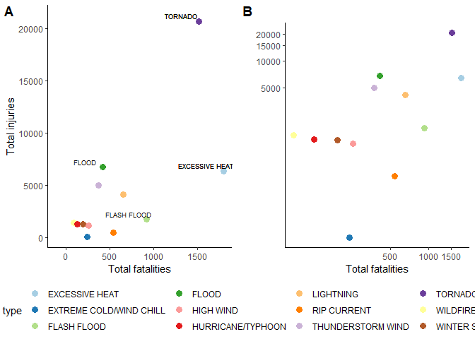
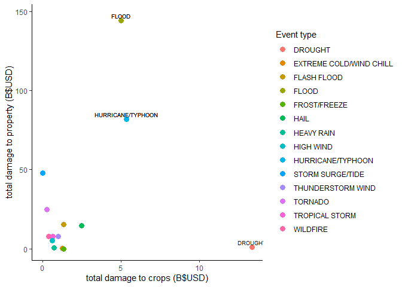

## Exploratory analysis: the impact of severe weather events on economy and population health in the United States. 

## Synopsis
Severe weather events may be responsible for damage to property, commerce, health and life.
The degree of this impact is likely to vary by the type of weather event.  
The U.S. National Oceanic and Atmospheric Administration's (NOAA) storm database includes data on severe weather events recorded across the USA between the year 1950 and November 2011, and describes approximately 50 weather event types.

This analysis addresses the following questions based on the most recent data within this timeframe: 

1. Across the United States, which types of events are most harmful with respect to population health?

Outcome data for population health are injury and fatality counts.

2. Across the United States, which types of events have the greatest economic consequences?

Outcome data for economic consequences are property damage and crop damage totals in USD.


## Data Processing


```r
knitr::opts_chunk$set(echo = TRUE)
```


### Data import

The following loads the required libraries and directory, downloads the dataset, reads it into RStudio, and provides the dataframe's size.


```r
library(dplyr)
```

```
## 
## Attaching package: 'dplyr'
```

```
## The following objects are masked from 'package:stats':
## 
##     filter, lag
```

```
## The following objects are masked from 'package:base':
## 
##     intersect, setdiff, setequal, union
```

```r
library(ggplot2)
library(ggpubr)
```

```
## Loading required package: magrittr
```

```r
library(lubridate)
```

```
## 
## Attaching package: 'lubridate'
```

```
## The following object is masked from 'package:base':
## 
##     date
```

```r
library(tidyverse)
```

```
## -- Attaching packages ------------------------------------------- tidyverse 1.2.1 --
```

```
## v tibble  2.1.3     v purrr   0.3.3
## v tidyr   1.0.0     v stringr 1.4.0
## v readr   1.3.1     v forcats 0.4.0
```

```
## -- Conflicts ---------------------------------------------- tidyverse_conflicts() --
## x lubridate::as.difftime() masks base::as.difftime()
## x lubridate::date()        masks base::date()
## x tidyr::extract()         masks magrittr::extract()
## x dplyr::filter()          masks stats::filter()
## x lubridate::intersect()   masks base::intersect()
## x dplyr::lag()             masks stats::lag()
## x purrr::set_names()       masks magrittr::set_names()
## x lubridate::setdiff()     masks base::setdiff()
## x lubridate::union()       masks base::union()
```


```r
setwd("C:/Users/Richard")

if (!file.exists("./RepData_PeerAssessment2")){
        dir.create("./RepData_PeerAssessment2")
}

fileUrl <- "https://d396qusza40orc.cloudfront.net/repdata%2Fdata%2FStormData.csv.bz2"

download.file(fileUrl, destfile="./RepData_PeerAssessment2/stormdata.csv.bz2")
```

The file is read and cached:

```r
setwd("C:/Users/Richard")
start_Time <- Sys.time()
stormdata <- read.csv("./RepData_PeerAssessment2/stormdata.csv.bz2")
end_Time <- Sys.time()
round(end_Time - start_Time,2)
```

```
## Time difference of 2.14 mins
```

```r
dim(stormdata)
```

```
## [1] 902297     37
```

```r
format(object.size(stormdata), units="auto")
```

```
## [1] "414.1 Mb"
```


### Data selection

An object, "types", is created that stores the required levels and also includes "LANDSLIDE", since no observations correspond to the re-classified "DEBRIS FLOW" (see documentation). 


```r
#Select relevant variables:
stormdata <- stormdata %>% select(BGN_DATE, END_DATE, STATE, EVTYPE, FATALITIES, INJURIES, PROPDMG, PROPDMGEXP, CROPDMG, CROPDMGEXP, REMARKS)

#create 'types' object
types <- c("ASTRONOMICAL LOW TIDE", "AVALANCHE", "BLIZZARD", "COASTAL FLOOD",
           "COLD / WIND CHILL", "DEBRIS FLOW", "DENSE FOG", "DENSE SMOKE", "DROUGHT","DUST DEVIL","DUST STORM","EXCESSIVE HEAT","EXTREME COLD/WIND CHILL","FLASH FLOOD","FLOOD","FREEZING FOG","FROST/FREEZE","FUNNEL CLOUD","HAIL","HEAT","HEAVY RAIN","HEAVY SNOW","HIGH SURF","HIGH WIND","HURRICANE/TYPHOON","ICE STORM","LAKESHORE FLOOD","LAKE-EFFECT SNOW","LIGHTNING","MARINE HAIL","MARINE HIGH WIND","MARINE STRONG WIND","MARINE THUNDERSTORM WIND","RIP CURRENT","SEICHE", "SLEET","STORM SURGE/TIDE","STRONG WIND", "THUNDERSTORM WIND","TORNADO","TROPICAL DEPRESSION","TROPICAL STORM","TSUNAMI","VOLCANIC ASH","WATERSPOUT","WILDFIRE","WINTER STORM","WINTER WEATHER","LANDSLIDE")
```

There are 985 levels of the `EVTYPE` variable. 
The `EVTYPE` variable should contain the 48 levels specified in the data documentation. 

Steps 1-4 below creates the health outcome data set to be used for reporting the population health results. 

This is followed by similar steps to create the economy outcome set for reporting the economic data.

### Health outcomes: Step 1 - Data selection

Data are subset by observations where more than 1 injury or fatality occurred.  


```r
#subset by injury/fatality and check dimensions
healthdata <- stormdata[stormdata$INJURIES > 0 | stormdata$FATALITIES > 0, ]
dim(healthdata)
```

```
## [1] 21929    11
```

```r
#check levels of EVTYPE in health data
length(unique(healthdata$EVTYPE))
```

```
## [1] 220
```

```r
#recode variable to match with types list
categories <- as.character(unique(healthdata$EVTYPE))

#create object indicating which obs have EVTYPES that match.
matched <-  categories[(categories %in% types)]
```
880368 entries are removed when including only data for which a single fatality or injury occurred.

There are 220 unique categories in the `EVTYPE` variable in the preliminary injury and fatality data. 

### Health outcomes: Step 2 - Processing date data


```r
# Exploring and Formating dates
end_miss <- sum(healthdata$END_DATE == "")

bgn_miss <- sum(healthdata$BGN_DATE == "")

any(is.na(healthdata$BGN_DATE))
```

```
## [1] FALSE
```

```r
# reformat BGN_DATE variable to date format
healthdata$BGN_DATE <- mdy_hms(healthdata$BGN_DATE) 
```
While the end date may be preferred as a measure of the timing of the event (for the purpose of assessing the outcome of the event), 40% (n=8854) of the observations for this variable in the health outcome data is missing.
0 beginning dates are missing. 
Taken together, it is preferable to use only `BGN_DATE` as the indicator of the timing of the event. 

`END_DATE` is removed.  

```r
healthdata$END_DATE=NULL
```


```r
### Health outcomes: Step 2b - Processing event type data

#A new binary variable indicating whether or not the event types match the documentation is created:
healthdata$typematch <- healthdata$EVTYPE %in% matched

# Data split into matched and mismatched. 
# Match set is given by:
match <- healthdata[healthdata$typematch==TRUE, ]

# Mis-matched set is given by:
mismatch <- healthdata[healthdata$typematch==FALSE, ]
```


### Health outcomes: Step 3 - Subsetting by date range 

More recent entries represent more complete data. 

This step identifies a date range which is relevant to informing future allocation of resources to prevent fatalities and injuries arising from weather events. 


```r
#Matched / mismatched data are viewed separately:

sumMatch <- match %>% 
        group_by(EVTYPE) %>% 
        filter(year(BGN_DATE) < "1996") %>%
        summarize(COUNT = n(),
                  YEARS = n_distinct(year(BGN_DATE)),
                  FAT = sum(FATALITIES),
                  INJ = sum(INJURIES))

sumMismatch <- mismatch %>% 
        group_by(EVTYPE) %>% 
        filter(year(BGN_DATE) < "1996") %>%
        summarize(COUNT = n(),
                  YEARS = n_distinct(year(BGN_DATE)),
                  FAT = sum(FATALITIES),
                  INJ = sum(INJURIES))

#Data are filtered according to date. Data since 1996:

sumMatch_1996 <- match %>% 
        group_by(EVTYPE) %>% 
        filter(year(BGN_DATE)>="1996") %>%
        summarize(COUNT = n(),
                  YEARS = n_distinct(year(BGN_DATE)),
                  FAT = sum(FATALITIES),
                  INJ = sum(INJURIES))

sumMismatch_1996 <- mismatch %>% 
        group_by(EVTYPE) %>% 
        filter(year(BGN_DATE)>="1996") %>%
        summarize(COUNT = n(),
                  YEARS = n_distinct(year(BGN_DATE)),
                  FAT = sum(FATALITIES),
                  INJ = sum(INJURIES))

# A comparison of the matched and mismatched events including periods before 1996 with those after 1996 shows little is lost that could change the relative rankings of the events' impact, judged by total injury and fatality counts.

#Therefore, it seems reasonable to subset to observations from the beginning of 1996. The exact date cut-off may be somewhat arbitrary. 

#Over time, classification guidelines have changed, as can be seen for example when comparing 'high wind' and 'thunderstorm wind' counts before and afer 1996.
```


### Health outcomes: Step 4 - Integrating the event type data to create final health dataset

Data will be subset by years since the beginning of 1996, giving recent context. Thresholds were decided based on the summary datasets: sumMatched_1996 and sumMismatched_1996. This conservative threshold balances maximising the data to be included, with removing: 

1. the older data biasing events recorded in earlier vs later years.

2. event types with total fatality and injury counts over the sixteen year period that are insufficient to impact the relative ranking of the top 10 matched weather events. 

The following identifies the events to include in further analysis, based on the fatality and injury counts across the (approx.) sixteen year period: 1996 to Nov 2011.

The final processing step integrates the most dangerous event types.


```r
tomatch <- sumMismatch_1996[ sumMismatch_1996$FAT >= 3 | 
           sumMismatch_1996$INJ  >= 15, ]


#labels will be re-coded - each prominent event was cross-checked using the detailed descriptions of events in the original stormdata (see 'Remarks' variable).

healthdata$EVTYPE[ healthdata$EVTYPE == 'BLACK ICE'] <- 'FROST/FREEZE'
healthdata$EVTYPE[ healthdata$EVTYPE == 'EXTREME COLD'] <- 'EXTREME COLD/WIND CHILL'
healthdata$EVTYPE[ healthdata$EVTYPE == 'FOG'] <- 'DENSE FOG'
healthdata$EVTYPE[ healthdata$EVTYPE == 'HURRICANE'] <- 'HURRICANE/TYPHOON'
healthdata$EVTYPE[ healthdata$EVTYPE == 'RIP CURRENTS'] <- 'RIP CURRENT'
healthdata$EVTYPE[ healthdata$EVTYPE == 'TSTM WIND'] <- 'THUNDERSTORM WIND'
healthdata$EVTYPE[ healthdata$EVTYPE == 'WINTER WEATHER/MIX'] <- 'WINTER WEATHER'
healthdata$EVTYPE[ healthdata$EVTYPE == 'URBAN/SML STREAM FLD'] <- 'FLASH FLOOD'
healthdata$EVTYPE[ healthdata$EVTYPE == 'WIND'] <- 'HIGH WIND'
healthdata$EVTYPE[ healthdata$EVTYPE == 'HEAVY SURF/HIGH SURF'] <- 'HIGH SURF'
healthdata$EVTYPE[ healthdata$EVTYPE == 'ROUGH SURF'] <- 'HIGH SURF'
healthdata$EVTYPE[ healthdata$EVTYPE == 'High Surf'] <- 'HIGH SURF'
healthdata$EVTYPE[ healthdata$EVTYPE == 'HEAVY SURF'] <- 'HIGH SURF'
healthdata$EVTYPE[ healthdata$EVTYPE == 'ICY ROADS'] <- 'FROST/FREEZE'
healthdata$EVTYPE[ healthdata$EVTYPE == 'RAIN/SNOW'] <- 'FLASH FLOOD' #see event description
healthdata$EVTYPE[ healthdata$EVTYPE == 'WILD/FOREST FIRE'] <- 'WILDFIRE'
```

Finally, the dataset is collapsed over event type to provide the complete fatality and injury data per event, since 1996.

The first dataset (healthdata_1996) is ranked by fatalities, the second (healthdata_1996_I) is identical, ranked by injuries, identifying the top 10 events for fatality and injury, respectively.


```r
healthdata_1996 <- healthdata %>% 
        group_by(EVTYPE) %>% 
        filter(year(BGN_DATE) >= "1996") %>%
        summarize(COUNT = n(),
                  YEARS = n_distinct(year(BGN_DATE)),
                  FAT = sum(FATALITIES, na.rm = TRUE),
                  INJ = sum(INJURIES, na.rm = TRUE)) %>% 
                  arrange(desc(FAT), desc(INJ))

healthdata_1996_I <- healthdata %>% 
        group_by(EVTYPE) %>% 
        filter(year(BGN_DATE) >= "1996") %>%
        summarize(COUNT = n(),
                  YEARS = n_distinct(year(BGN_DATE)),
                  FAT = sum(FATALITIES, na.rm=TRUE),
                  INJ = sum(INJURIES, na.rm=TRUE)) %>% 
                  arrange(desc(INJ))


#Top 10 by fatality:
head(healthdata_1996, n = 10)
```

```
## # A tibble: 10 x 5
##    EVTYPE                  COUNT YEARS   FAT   INJ
##    <fct>                   <int> <int> <dbl> <dbl>
##  1 EXCESSIVE HEAT            665    16  1797  6391
##  2 TORNADO                  1968    16  1511 20667
##  3 FLASH FLOOD               892    16   919  1755
##  4 LIGHTNING                2649    16   651  4141
##  5 RIP CURRENT               599    16   542   503
##  6 FLOOD                     372    16   414  6758
##  7 THUNDERSTORM WIND        2284    16   371  5029
##  8 HIGH WIND                 548    16   253  1167
##  9 EXTREME COLD/WIND CHILL   182    16   238   103
## 10 HEAT                      160    10   237  1222
```

```r
#Top 10 by injury:
head(healthdata_1996_I, n = 10)
```

```
## # A tibble: 10 x 5
##    EVTYPE            COUNT YEARS   FAT   INJ
##    <fct>             <int> <int> <dbl> <dbl>
##  1 TORNADO            1968    16  1511 20667
##  2 FLOOD               372    16   414  6758
##  3 EXCESSIVE HEAT      665    16  1797  6391
##  4 THUNDERSTORM WIND  2284    16   371  5029
##  5 LIGHTNING          2649    16   651  4141
##  6 FLASH FLOOD         892    16   919  1755
##  7 WILDFIRE            331    16    87  1456
##  8 HURRICANE/TYPHOON    57    12   125  1321
##  9 WINTER STORM        215    16   191  1292
## 10 HEAT                160    10   237  1222
```

See Results: Fig. 1 for further details.


### Economy: Step 1 - Data selection

The raw stormdata set is first limited to observations for which damage to crop or property totals are available.


```r
econdata <- stormdata[ stormdata$PROPDMG > 0 | stormdata$CROPDMG > 0, ]

unique <- length(unique(econdata$EVTYPE))

dim(econdata)
```

```
## [1] 245031     11
```

```r
econcats <- as.character(unique(econdata$EVTYPE))

matched <-  econcats[(econcats %in% types)]
```

There are 431 unique categories in the `EVTYPE` variable in the preliminary crop and property damage data.

### Economy: Step 2 - Processing date data


```r
# Exploring/Formating dates

sum(econdata$END_DATE=="")
```

```
## [1] 48241
```

```r
bgn_miss <- sum(econdata$BGN_DATE=="")

any(is.na(econdata$BGN_DATE))
```

```
## [1] FALSE
```

```r
# reformat BGN_DATE variable to date format
econdata$BGN_DATE <- mdy_hms(econdata$BGN_DATE) 
```
Observations for `END_DATE` are missing in the economic data.
0 observations are missing data for the beginning dates. 
Taken together, it is preferable to use only `BGN_DATE` as the indicator of the timing of the event. 

`END_DATE` is removed.  

```r
econdata$END_DATE=NULL
```

### Economy: Step 3 - Cleaning variables: `PROPDMG`, `PROPDMGEXP`, `CROPDMG`, `CROPDMGEXP`

variables are combined to give the numeric value of damage to crops and property.


```r
unique(econdata$CROPDMGEXP)
```

```
## [1]   M K m B ? 0 k
## Levels:  ? 0 2 B k K m M
```

```r
unique(econdata$PROPDMGEXP)
```

```
##  [1] K M B m   + 0 5 6 4 h 2 7 3 H -
## Levels:  - ? + 0 1 2 3 4 5 6 7 8 B h H K m M
```

```r
econdata <- econdata %>% 
            mutate(CROPDMGEXP = recode(CROPDMGEXP, 'B'=1e+9, 
                                       'M'=1e+6, 'm'=1e+6, 'K'=1000,'k'=1000))

econdata <- econdata %>% 
            mutate(PROPDMGEXP = recode(PROPDMGEXP, 'B'=1e+9, 
                                        'm'= 1e+6, 'M'=1e+6, 'K'=1000))

unique(econdata$CROPDMGEXP)
```

```
## [1]    NA 1e+06 1e+03 1e+09
```

```r
#NA's introduced as expected

unique(econdata$PROPDMGEXP)
```

```
## [1] 1e+03 1e+06 1e+09    NA
```

```r
#NA's introduced as expected


#New numeric variables are created. These are the outcome variables for property and crop damage, respectvely.

econdata$PROPDMGNUM <- econdata$PROPDMG * econdata$PROPDMGEXP 

econdata$CROPDMGNUM <- econdata$CROPDMG * econdata$CROPDMGEXP
```

### Economy: Step 4 - Processing event type data


```r
#A new binary variable indicating whether or not the event types match the documentation is created:

econdata$typematch <- econdata$EVTYPE %in% matched

# Data is split into matched and mismatched. 

# Matched set is given by:
match <- econdata[econdata$typematch == TRUE, ]

# Mismatched set is given by:
mismatch <- econdata[econdata$typematch == FALSE, ]

#Summary sets are created (can be used to check validity of splitting at 1996): 
sumMatch_1996 <- match %>% 
        group_by(EVTYPE) %>% 
        filter(year(BGN_DATE) >= "1996") %>%
        summarize(COUNT = n(),
                  YEARS = n_distinct(year(BGN_DATE)),
                  PROP = sum(PROPDMGNUM),
                  CROP = sum(CROPDMGNUM))

sumMismatch_1996 <- mismatch %>% 
        group_by(EVTYPE) %>% 
        filter(year(BGN_DATE) >= "1996") %>%
        summarize(COUNT = n(),
                  YEARS = n_distinct(year(BGN_DATE)),
                  PROP = sum(PROPDMGNUM),
                  CROP = sum(CROPDMGNUM))
```

### Economy: Step 5 - Integrate `EVTYPE` data to create final set


```r
#labels are re-coded to the matched dataset.

#each event is cross-checked using the detailed descriptions of events in the original stormdata ('remarks variable').

econdata$EVTYPE[econdata$EVTYPE == 'EXTREME COLD'] <- 'EXTREME COLD/WIND CHILL'
econdata$EVTYPE[econdata$EVTYPE == 'Frost/Freeze'] <- 'FROST/FREEZE'
econdata$EVTYPE[econdata$EVTYPE == 'FOG'] <- 'DENSE FOG'
econdata$EVTYPE[econdata$EVTYPE == 'AGRICULTURAL FREEZE'] <- 'FROST/FREEZE'
econdata$EVTYPE[econdata$EVTYPE == 'FREEZE'] <- 'FROST/FREEZE'
econdata$EVTYPE[econdata$EVTYPE == 'Early Frost'] <- 'FROST/FREEZE'
econdata$EVTYPE[econdata$EVTYPE == 'Damaging Freeze'] <- 'FROST/FREEZE'
econdata$EVTYPE[econdata$EVTYPE == 'GUSTY WINDS'] <- 'FLASH FLOOD' #see remarks
econdata$EVTYPE[econdata$EVTYPE == 'Heavy Rain/High Surf'] <- 'HIGH SURF'
econdata$EVTYPE[econdata$EVTYPE == 'HURRICANE'] <- 'HURRICANE/TYPHOON'
econdata$EVTYPE[econdata$EVTYPE == 'RIVER FLOOD'] <- 'FLOOD' #see remarks
econdata$EVTYPE[econdata$EVTYPE == 'River Flooding'] <- 'FLOOD' #see remarks
econdata$EVTYPE[econdata$EVTYPE == 'COASTAL FLOODING'] <- 'COASTAL FLOOD' 
econdata$EVTYPE[econdata$EVTYPE == 'Coastal Flood'] <- 'COASTAL FLOOD' 
econdata$EVTYPE[econdata$EVTYPE == 'SMALL HAIL'] <- 'HAIL'
econdata$EVTYPE[econdata$EVTYPE == 'STORM SURGE'] <- 'STORM SURGE/TIDE'
econdata$EVTYPE[econdata$EVTYPE == 'TSTM WIND'] <- 'THUNDERSTORM WIND'
econdata$EVTYPE[econdata$EVTYPE == 'TSTM WIND/HAIL'] <- 'THUNDERSTORM WIND'
econdata$EVTYPE[econdata$EVTYPE == 'TYPHOON'] <- 'HURRICANE/TYPHOON'
econdata$EVTYPE[econdata$EVTYPE == 'URBAN/SML STREAM FLD'] <- 'FLASH FLOOD'
econdata$EVTYPE[econdata$EVTYPE == 'WILD/FOREST FIRE'] <- 'WILDFIRE'
```

The final datasets summarise the complete economic outcome data since 1996:


```r
econdata_1996 <- econdata %>% 
        group_by(EVTYPE) %>% 
        filter(year(BGN_DATE) >= "1996") %>%
        summarize(COUNT = n(),
                  YEARS = n_distinct(year(BGN_DATE)),
                  PROP = sum(PROPDMGNUM, na.rm=TRUE),
                  CROP = sum(CROPDMGNUM, na.rm=TRUE)) %>% 
                  arrange(desc(PROP),desc(CROP))

econdata_1996_C <- econdata %>% 
        group_by(EVTYPE) %>% 
        filter(year(BGN_DATE)>="1996") %>%
        summarize(COUNT = n(),
                  YEARS = n_distinct(year(BGN_DATE)),
                  PROP = sum(PROPDMGNUM, na.rm=TRUE),
                  CROP = sum(CROPDMGNUM, na.rm=TRUE)) %>% 
                  arrange(desc(CROP))

#top 10 by damage to property:
head(econdata_1996, n=10)
```

```
## # A tibble: 10 x 5
##    EVTYPE             COUNT YEARS         PROP       CROP
##    <fct>              <int> <int>        <dbl>      <dbl>
##  1 FLOOD               9494    16 144071270550 5004673400
##  2 HURRICANE/TYPHOON    199    14  81718889010 5350107800
##  3 STORM SURGE/TIDE     212    16  47834724000     855000
##  4 TORNADO            12147    16  24616945710  283425010
##  5 FLASH FLOOD        19416    16  15280851560 1343589800
##  6 HAIL               22621    16  14595213420 2496822450
##  7 THUNDERSTORM WIND 104660    16   7905016380 1016942600
##  8 WILDFIRE            1084    16   7760449500  402255130
##  9 TROPICAL STORM       401    16   7642475550  677711000
## 10 HIGH WIND           5236    16   5247860360  633561300
```

```r
#top 10 by damage to crops:
head(econdata_1996_C, n=10)
```

```
## # A tibble: 10 x 5
##    EVTYPE                   COUNT YEARS         PROP        CROP
##    <fct>                    <int> <int>        <dbl>       <dbl>
##  1 DROUGHT                    258    16   1046101000 13367566000
##  2 HURRICANE/TYPHOON          199    14  81718889010  5350107800
##  3 FLOOD                     9494    16 144071270550  5004673400
##  4 HAIL                     22621    16  14595213420  2496822450
##  5 FROST/FREEZE               135    14     10680000  1345361000
##  6 FLASH FLOOD              19416    16  15280851560  1343589800
##  7 EXTREME COLD/WIND CHILL     99    12     28408400  1289023000
##  8 THUNDERSTORM WIND       104660    16   7905016380  1016942600
##  9 HEAVY RAIN                 977    16    584864440   728169800
## 10 TROPICAL STORM             401    16   7642475550   677711000
```

See Results: Fig. 2 for further details.


## Results

### Health Outcomes

Analysis has revealed:

the 10 top killers: 

1. Excessive Heat
2. Tornado
3. Flash Flood 
4. Lightning
5. Rip current 
6. Flood
7. Thunderstorm Wind 
8. High Wind 
9. Extreme Cold/Wind Chill 
10. Heat

The 10 most dangerous events by injury count: 

1. Tornado
2. Flood
3. Excessive Heat
4. Thunderstorm Wind
5. Lightning
6. Flash Flood
7. Wildfire
8. Hurricane/Typhoon
9. Winter Storm
10. Heat

Figure 1 below displays the fatality vs injury data:


```r
#Plotting the top 10 for each (12 total): 

healthdata_1996_10 <- healthdata_1996[healthdata_1996$EVTYPE %in% c("TORNADO","EXCESSIVE HEAT","LIGHTNING","FLASH FLOOD","FLOOD", "HURRICANE/TYPHOON","EXTREME COLD/WIND CHILL","HIGH WIND","RIP CURRENT","WINTER STORM","WILDFIRE","THUNDERSTORM WIND"), ]

healthdata_1996_10 <- healthdata_1996_10 %>% arrange(FAT)

healthdata_1996_10$EVTYPE <- as.character(healthdata_1996_10$EVTYPE)

pophealth <- ggplot(healthdata_1996_10, aes(FAT,INJ))+
        geom_point(size = 3,aes(col=EVTYPE))+
        labs(col="Event type")+
        labs(x="Total fatalities", y="Total injuries")+ 
        scale_colour_brewer(palette  ="Paired")+ 
        geom_text(aes(label = ifelse(FAT>750, EVTYPE, "")),
                      size = 2.5, nudge_x = -200, nudge_y=500) +
        geom_text(aes(label = ifelse(INJ > 6000, EVTYPE, "")),
                      size = 2.5, nudge_x = -200, nudge_y=500) +
        theme_classic()

pophealthlog <- ggplot(healthdata_1996_10, aes(FAT,INJ))+
        geom_point(size = 3,aes(col=EVTYPE))+
        labs(title=" ") + 
        labs(x="Total fatalities", y="")+ 
        scale_colour_brewer(palette  ="Paired")+
        coord_trans(x="log10",y="log10")+
        theme_classic()

ggarrange(pophealth, pophealthlog, labels=(c("A","B")), ncol=2, nrow=1, common.legend=TRUE, legend="bottom")
```

<!-- -->

Figure 1. Fatality against injury counts over the date span of the selected data (Jan 1996 to November 2011). Plot **A**:  top 10 events by injury and fatality are shown on their measured scale. Events causing death and injury are correlated, with 12 events comprising the top ten lists. Tornado, Excessive heat and flash flooding are the most deadly by fatality count over approx. 16 years. Tornado, flood, and excessive heat cause the greatest injury. Plot **B**: The same data, plotted on the log_10 scale, better displaying the relative impact of the lower-ranked events comprising the top 10 lists.   

### Economic Outcomes

Top 10 by property damage: 

1. Flood
2. Hurricane/Typhoon
3. Storm Surge/Tide
4. Tornado
5. Flash flood
6. Hail
7. Thunderstorm Wind
8. Wildfire
9. Tropical Storm
10. High wind

Top 10 by crop damage: 

1. Drought
2. Hurricane/Typhoon
3. Flood
4. Hail 
5. Frost/Freeze
6. Flash Flood
7. Extreme Cold / Wind Chill
8. Thunderstorm Wind
9. Heavy Rain
10. Tropical Storm

Figure 2 below displays the damage cost data (note the difference in scale between property and crop damage):


```r
econdata_1996_10 <- econdata_1996[econdata_1996$EVTYPE %in% c("FLOOD","STORM SURGE/TIDE", "HURRICANE/TYPHOON","FLASH FLOOD", "TORNADO", "HAIL", "FROST/FREEZE", "WILDFIRE","THUNDERSTORM WIND", "HIGH WIND", "TROPICAL STORM", "DROUGHT", "EXTREME COLD/WIND CHILL", "HEAVY RAIN"), ]

econdata_1996_10$PROPB <- econdata_1996_10$PROP / 1e+9 
econdata_1996_10$CROPB <- econdata_1996_10$CROP / 1e+9

econdata_1996_10$EVTYPE <- as.character(econdata_1996_10$EVTYPE)

econ <- ggplot(econdata_1996_10, aes(CROPB, PROPB))
econ +  geom_point(size = 3, aes(col = EVTYPE)) +
        labs(col = "Event type") +
        geom_text(aes(label = ifelse(PROPB > 50, EVTYPE, "")),
                    size = 2.5, nudge_y = +3) +
        geom_text(aes(label = ifelse(CROPB>5,EVTYPE,"")),
                    size = 2.5, nudge_y = +3) +
        labs(y = "total damage to property (B$USD)", 
             x = "total damage to crops (B$USD)") +
        #scale_colour_brewer(palette  ="Paired")+
        theme_classic()
```

<!-- -->

Figure 2. Total damage to crops and property by event type over the selected date range (January 1996 to November 2011). There is some correlation between events causing damage to crops and property, with 14 events comprising the respective top 10 lists. However, there are clearly important differences between event types affecting crops, and event types affecting property. Floods, hurricanes and storm/tide surges are the most damaging to property, and drought is the most damaging to crops. On their respective axes, these far outweigh the damage caused by other events. In general, property damage costs far outweigh crop damage costs. Not shown is the nature of these events: whether or not the damage is cumulative or arises from one-off events.  

## Resources

* National Weather Service [Storm Data Documentation](https://d396qusza40orc.cloudfront.net/repdata%2Fpeer2_doc%2Fpd01016005curr.pdf)

* National Climatic Data Center Storm Events [FAQ](https://d396qusza40orc.cloudfront.net/repdata%2Fpeer2_doc%2FNCDC%20Storm%20Events-FAQ%20Page.pdf)

